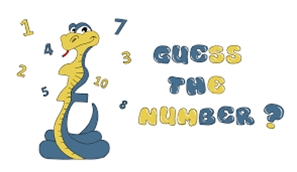
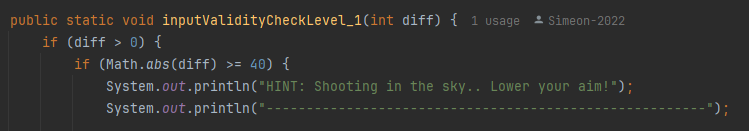
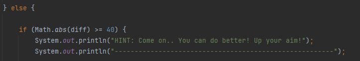
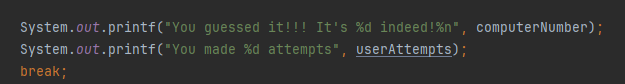
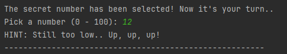
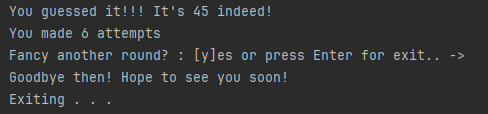
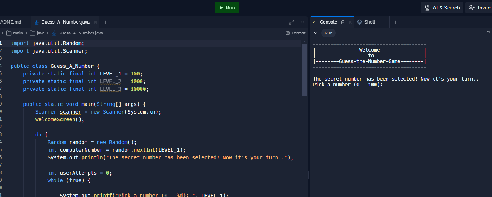

# Guess-A-Number

Console game called "Guess A Number":  "Guess A Number" is a game in which your opponent "the computer" chooses a random number between "1 and 100" and your task is to guess this number. After each number you enter, the computer will give you a hint of whether the number is greater or less than the number you selected until you guess the correct number: 

## Project goals
The goal of the project is to implement a console-based game by using the learned material during the JAVA-Fundamentals course.
The project made use of associative containers Map<String, String> and List<String>.
The project made use of methods called repetitively during the game do-while loops.

## Solution
Several simple If-Else checks have been implemented encapsulated in a separate method in order to gauge how far or 
close the user input actually is and to provide clues in a form of hints showing up under the user input

### Case #1:
If the difference between the user input and the secret number is positive then the user has picked too high of a number:

### Case #2:
If the difference between the user input and the secret number is negative then the user has picked too high of a number:

### Case #3:
If the difference between the user input and the secret number is exactly zero, then the game cycle ends with a display of the attempts made:

## Source code link:

https://github.com/Simeon-2022/Guess-A-Number/blob/main/Guess_A_Number.java

## Screenshots
- After the welcome screen the game cycle begins:

- The User is prompted for input:

- The final result is printed out and a prompt for another round:

## Live Demo
- You can play the game directly in your Web browser by pressing the "Run" button:
- https://replit.com/@simeonalexandro/Guess-A-Number

